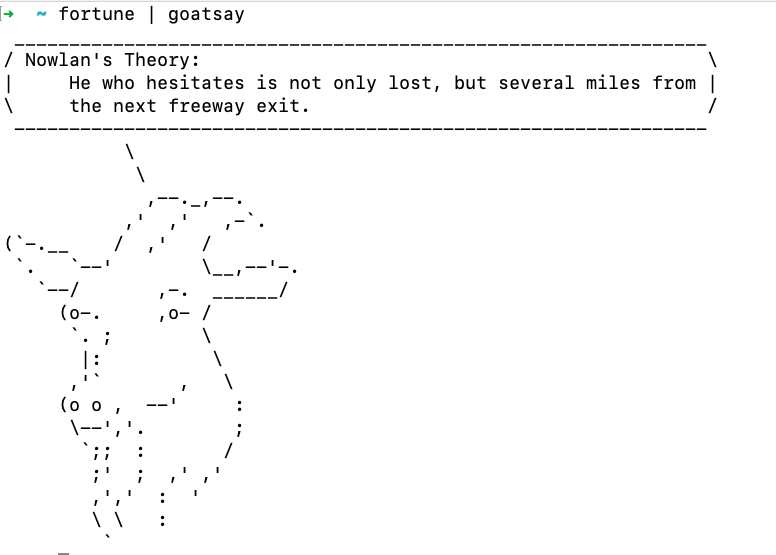

# Greetings form Goatsay



## What is this package

This package is a inspired form the [cowsay](https://en.wikipedia.org/wiki/Cowsay) package.
Main question is why the Goat?
Last year in my country (Bangladesh), a Goat emerged and exposed one corrupt government official and a corrupt company. [Source 1](https://www.dhakatribune.com/bangladesh/350440/the-saga-of-bangladesh%E2%80%99s-most-talked-about-goat) [Source 2](https://www.dhakatribune.com/bangladesh/349701/the-goatfather-who-really-bought-the-goat-priced)

In my opinion, that ripple effect has changed Bangladesh.
To remember that Goat, I wrote this programe. It's written in Go, because Javascript would be an insult to this Goat's legacy.

## Prerequisite

This package needs fortune. Ubuntu/Linux may already include this package. If not please downlaod it from here [Linux](https://www.shlomifish.org/open-source/projects/fortune-mod/)

macOS users can download it via [homebrew](https://formulae.brew.sh/formula/fortune)

```bash
brew install fortune
```

## Instalation and Running

### Using go install (tested)

```bash
go install github.com/marufMunshi/goatsay-cli/cmd/goatsay
```

```bash
fortune | goatsay
```

### running the binary

```bash
chmod +x goatsay-linux
```

```bash
fortune | ./goatsay-linux
```

## Tutotrial

I used this project to learn go, so the tutorial is quite large and beginner friendly
Please see this page for [tutorial](tutorial.md).
